"# examen-practico-huahuaccapa" 

````markdown
# Laboratorio 1: Análisis Forense de Logs con Python

Este proyecto corresponde al desarrollo del **Lab1**, enfocado en el análisis de logs de un servidor Linux (SSH) y un servidor web (Apache), con el objetivo de detectar posibles ataques y generar visualizaciones.

---

## Estructura del Proyecto

Directorio: `~/examen-practico-huahuaccapa/lab1`

```text
lab1/
├── access.log
├── auth.log
├── analizar_ssh.py
├── analizar_web.py
├── visualizar.py
├── generar_ataques_falsos.py
├── reporte_ssh.json
├── reporte_web.json
├── evidencias/
└── graficas/
    ├── heatmap_peticiones.png
    ├── peticiones_por_hora.png
    └── top_10_ssh_fallidos.png
````

---
## Creacion de la maquina virtual

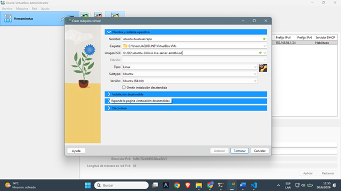
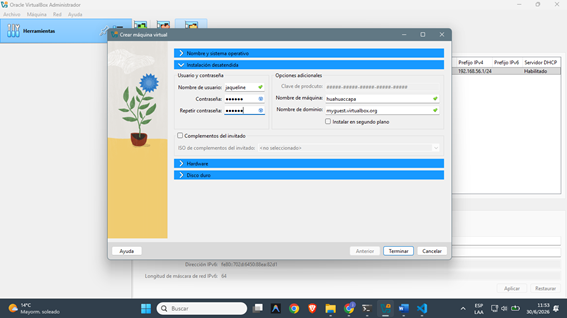
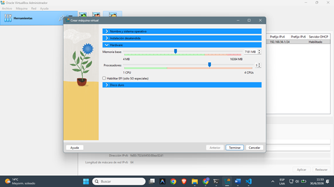
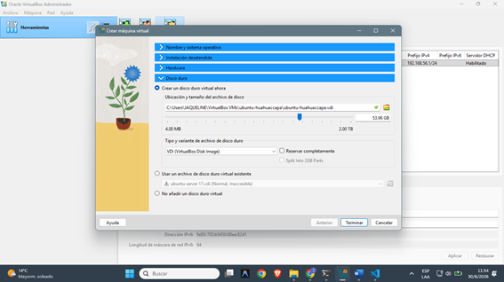

## Requisitos

* Python 3
* Librerías necesarias:

```bash
pip install matplotlib seaborn pandas
```

---

## Ejecución del Proyecto

### 1. Dar permisos a los scripts

```bash
chmod +x analizar_ssh.py analizar_web.py visualizar.py
```

---

### 2. (Opcional) Generar ataques de prueba

```bash
sudo python3 generar_ataques_falsos.py
```
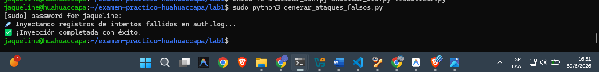
---

### 3. Ejecutar análisis de logs

#### Análisis SSH

```bash
python3 analizar_ssh.py
```

✔ Detecta intentos fallidos (`Failed password`)
✔ Cuenta intentos por IP
✔ Genera ranking de IPs
✔ Alerta si hay más de 50 intentos
✔ Exporta `reporte_ssh.json`

---
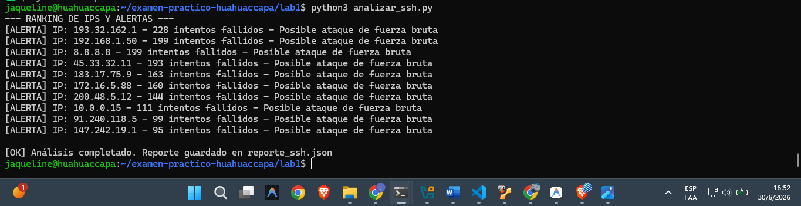
#### Análisis Web

```bash
python3 analizar_web.py
```

✔ Detecta escaneo de directorios (>20 rutas en <60s)
✔ Agrupa códigos HTTP (2xx, 3xx, 4xx, 5xx)
✔ Detecta posibles SQL Injection (`UNION`, `SELECT`, `--`)
✔ Genera `reporte_web.json`

---
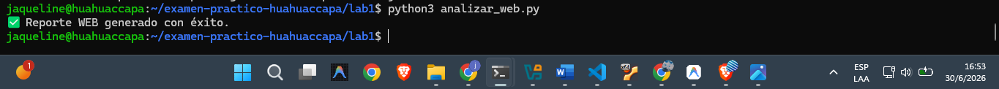
### 4. Generar visualizaciones

```bash
python3 visualizar.py
```
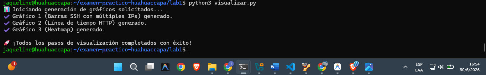
Se generan las siguientes gráficas en `graficas/`:

* 📊 **top_10_ssh_fallidos.png** → Top 10 IPs con más intentos fallidos
* 📈 **peticiones_por_hora.png** → Número de peticiones HTTP por hora
* 🔥 **heatmap_peticiones.png** → Peticiones por hora vs código HTTP

---

##  Descripción de Resultados

###  SSH (auth.log)

* Identificación de ataques de fuerza bruta
* Ranking de IPs más sospechosas
* Alertas automáticas por comportamiento anómalo

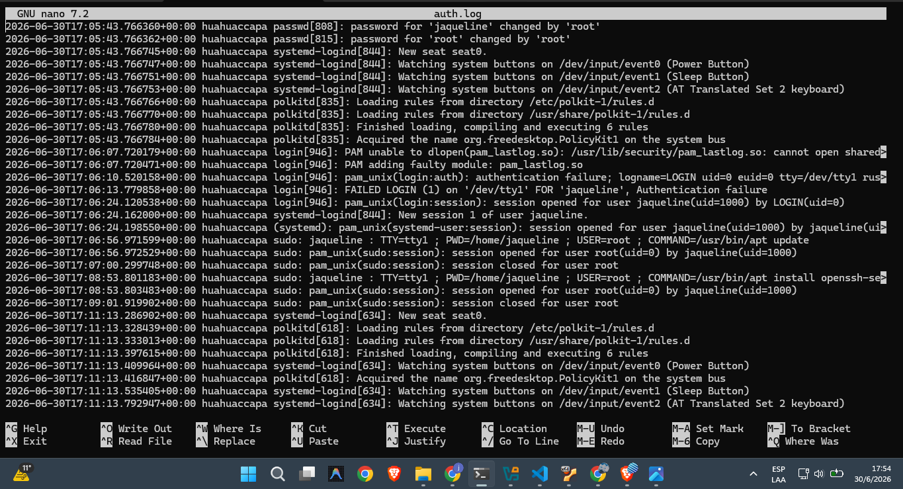

###  WEB (access.log)

* Detección de escaneo de directorios
* Identificación de ataques SQL Injection
* Análisis de tráfico HTTP por estado de respuesta
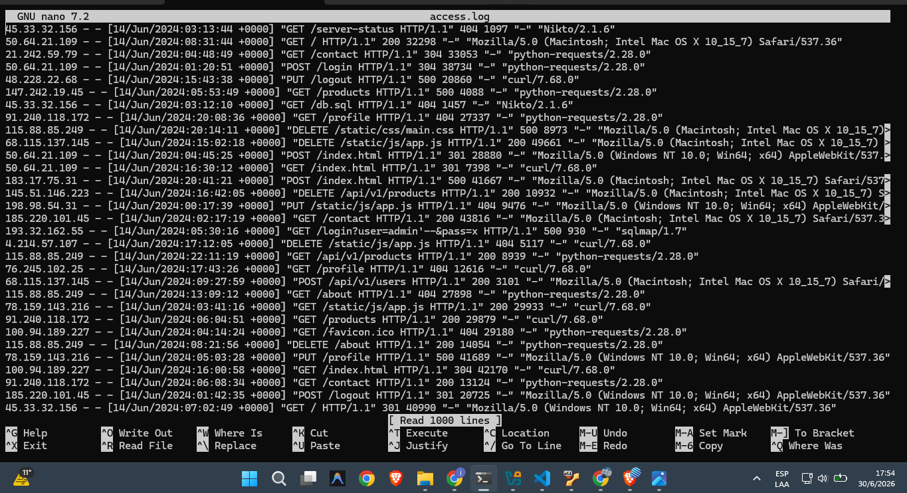

###  Visualización

* Análisis gráfico del comportamiento del servidor
* Identificación rápida de patrones sospechosos

---

##  Archivos Generados

* `reporte_ssh.json` → Resultados del análisis SSH
* `reporte_web.json` → Resultados del análisis WEB
* `graficas/*.png` → Evidencias visuales

---

##  Evidencias

Las capturas y pruebas adicionales pueden almacenarse en:

```text
evidencias/
```
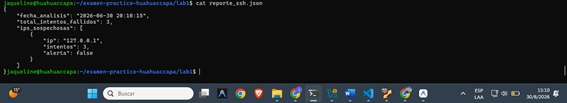
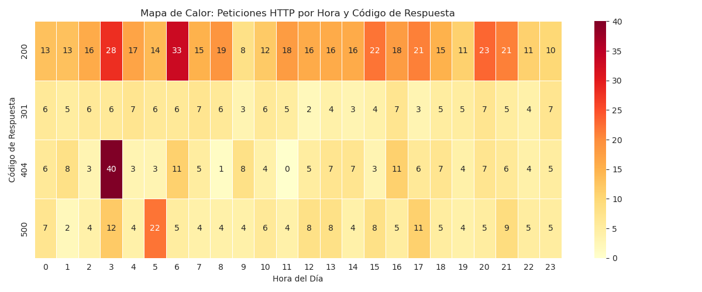
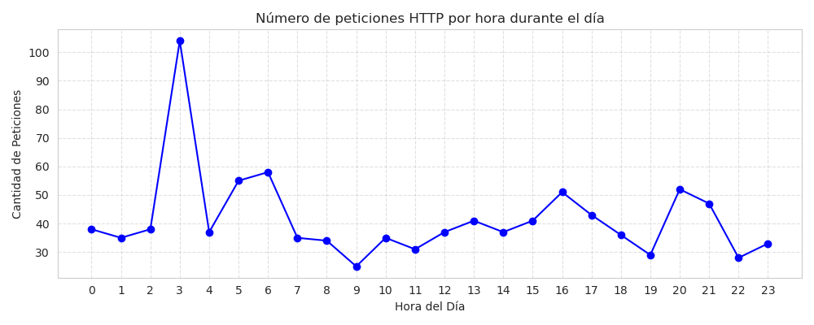
---

# Laboratorio 2: Reglas de Correlación en Wazuh

Este directorio contiene la configuración y evidencias del Laboratorio 2, enfocado en la implementación de reglas de correlación personalizadas para la detección de ataques.

# Creacion de la maquina virtual para Wazuh
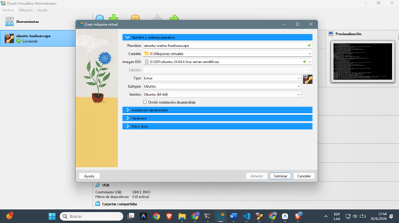
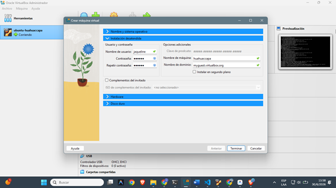
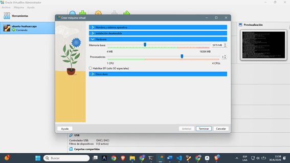
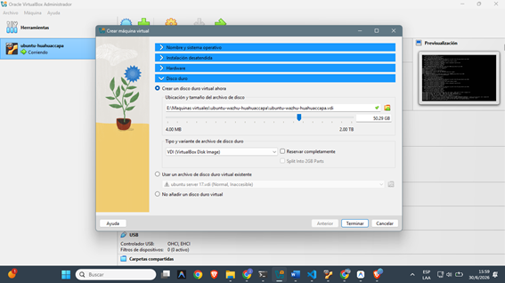


# Descargar e instalar el repositorio de Wazuh
curl -sO https://packages.wazuh.com/4.9/wazuh-install.sh && sudo bash ./wazuh-install.sh -a


    User: admin
    Password: JMS.RFdRq80XQWVZ*Sa1naCDiHKkhy5N

# Al finalizar, el comando te dará una contraseña para el dashboard. ¡Guárdala bien!

# Entrar a la carpeta principal
cd ~/examen-practico-huahuaccapa

# Crear la carpeta lab2 y sus subdirectorios
mkdir -p lab2/evidencia

## Estructura de archivos
- `local_rules_ssh.xml`: Regla para detección de fuerza bruta (10 fallos/60s).
- `local_rules_exfil.xml`: Regla para detección de exfiltración de datos (>500MB).
- `simular_bruteforce.sh`: Script para generar tráfico de prueba.
- `network_traffic.csv`: Dataset para pruebas de correlación.
- `evidencia/`: Capturas de pantalla de la validación del sistema.


## Pasos de Ejecución
1. Copiar reglas a Wazuh: `sudo cp *.xml /var/ossec/etc/rules/`
2. Reiniciar Wazuh: `sudo systemctl restart wazuh-manager`
3. Ejecutar simulación: `./simular_bruteforce.sh`
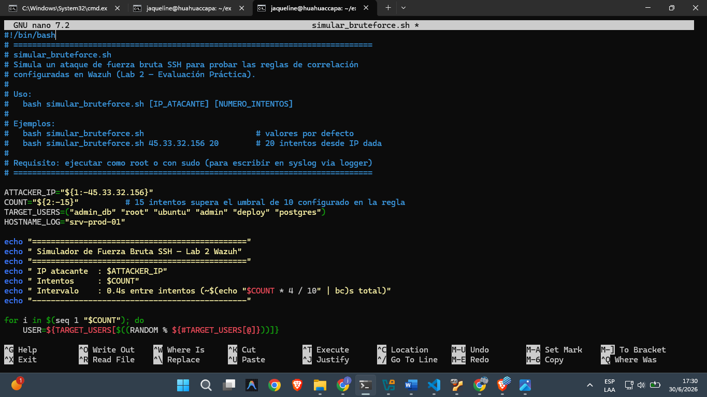


## 🎯 Conclusión

Este laboratorio permite:

* Detectar ataques reales en logs
* Automatizar análisis de seguridad
* Generar evidencia visual clara
* Aplicar técnicas de ciberseguridad en entornos reales

---

## 👩‍💻 Autor

**Jaqueline Huahuaccapa Ccama**
Ingeniería de Sistemas – UPeU

```